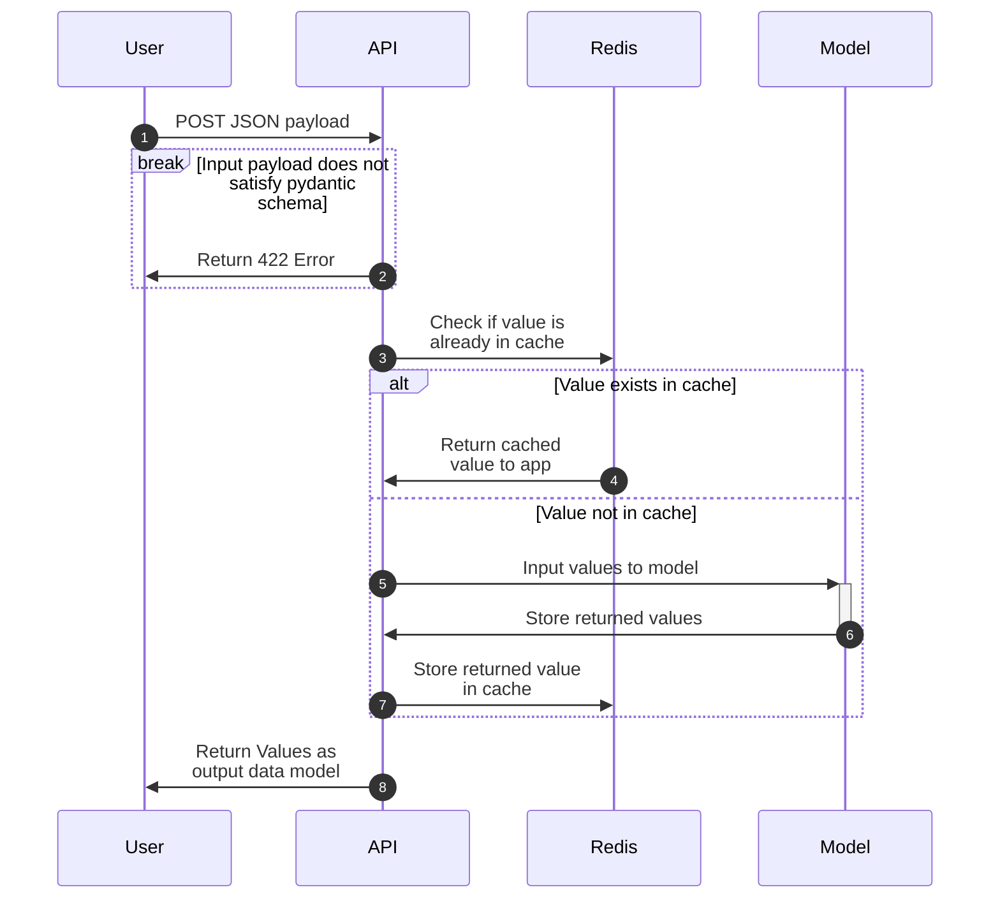
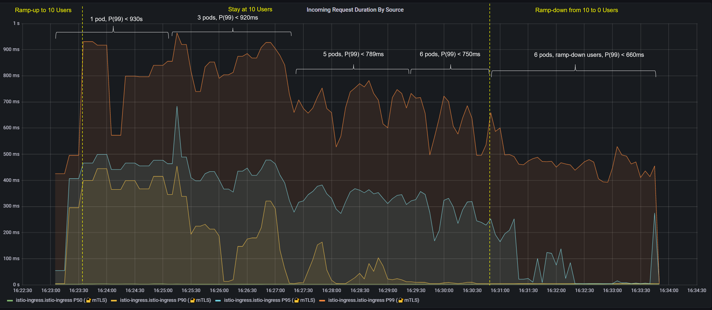
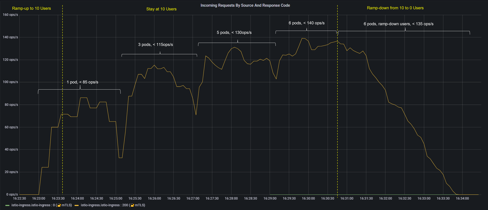
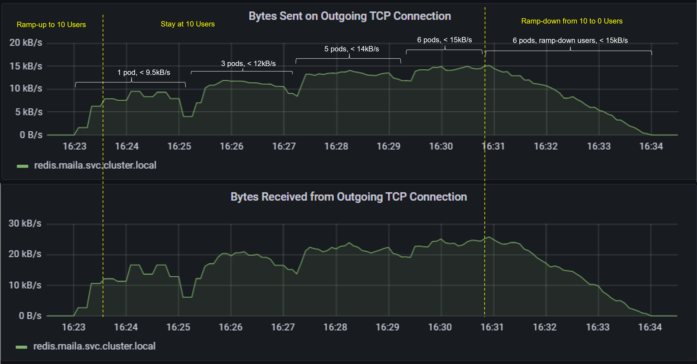

# MLOps Project: Full End-to-End Machine Learning API

<p align="center">
    <!--Hugging Face-->
        
    <!--PLUS SIGN-->
        
    <!--FAST API-->
        
    <!--PLUS SIGN-->
        
    <!--REDIS LOGO-->
        
    <!--PLUS SIGN-->
        
    <!--KUBERNETES-->
        
    <!--PLUS SIGN-->
        
    <!--Azure-->
        
    <!--PLUS SIGN-->
        
    <!--K6-->
        
    <!--PLUS SIGN-->
        
    <!--GRAFANA-->
        
</p>

- [MLOps Project: Full End-to-End Machine Learning API](#mlops-project-full-end-to-end-machine-learning-api)
  - [Project Overview](#project-overview)
    - [API Diagram](#api-diagram)
  - [Deploy Application](#deploy-application)
  - [Testing Application](#testing-application)
  - [Findings](#findings)
    - [Finding 1 - Latency](#finding-1---latency)
    - [Finding 2 - Requests Per Second](#finding-2---requests-per-second)
    - [Finding 3 - Caching](#finding-3---caching)

## Project Overview

The goal of this MLOps project is to build and deploy a fully functional prediction API accessible to end users. The prediction application is deployed on `Azure Kubernetes Service (AKS)`.

The application run a `FastAPI` API, it has the following endpoints:
* `/predict` endpoint, handle `POST` requests for a sentiment analysis model from `HuggingFace`.
* `/health` endpoint returns healthy status if the application is running.

The following tasks were implemented in this project:
- Utilize `Poetry` to define application dependancies. 
- Built pydantic models to match the specified input model
  - ```{"text": ["example 1", "example 2"]}```
- Package up an existing NLP model ([DistilBERT](https://arxiv.org/abs/1910.01108)) for running efficient CPU-based sentiment analysis from `HuggingFace`. The [model](https://huggingface.co/winegarj/distilbert-base-uncased-finetuned-sst2) is pulled locally to allow for loading into the application.
- Create an `FastAPI` application to serve prediction results from user requests.
- Test the application with `pytest`
- Utilize `Docker` to package the application as a logic unit of compute
- Cache results with `Redis` to protect the endpoint from abuse
- Deploy the application to `Azure` with `Kubernetes`
- Use `K6` to load test the application
- Use `Grafana` to visualize and understand the dynamics of the system


### API Diagram

The following is a visualization of the sequence diagram describing our API



## Deploy Application
The application is deployed in `AKS`, and using `kustomize` on `prod`.

```commandline
# DEPLOY APP TO AKS WITH KUSTOMIZE
kubectl kustomize .k8s/overlays/prod
kubectl apply -k .k8s/overlays/prod
```

- The endpoint could be accessed at `https://maila.mids255.com/predict`
- `curl` the endpoint to get the prediction results. `curl` command example:
  ```commandline
  curl -X 'POST' 'https://maila.mids255.com/predict' -L -H 'Content-Type: application/json' -d '{"text": ["Welcome to the project!", "You are awesome", "imposter syndrome"]}'
  ```

**Note:** Due to budget constraint the endpoint might not be currently in active. Please refer to the [test_images](test_images/) directory for demo of using the APP's endpoint.

## Testing Application

Local Testing:
- Run `pytest` to test the application locally before deployment
  ```commandline
  poetry run pytest -v
  ```

Load testing:

- Use `K6` to load test `/predict` endpoint after deploying
  ```commandline
  k6 run load.js
  ```
- Use the `Prometheus` Time Series Database (TSDB) to capture metrics from `istio` proxy sidecars
- Use `Grafana` to visualize these metrics using `istio`'s prebuilt dashboards. Port-forward `grafana` to the `localhost` to get access the timeseries plots
  ```bash
  kubectl port-forward -n prometheus svc/grafana 3000:3000
  ```

## Test Findings

**Test configurations**:
* Load test sequences:
  * Ramp-up from 1 to 10 virtual users over 30 seconds
  * Stay at 10 virtual users for 7 minutes
  * Ramp-down from 10 to 0 virtual users over 3 minutes
* The application has 3 minutes (180s) cache time (each unique key or `POST` request data is stored in memory for 3 minutes)
* Test `CACHE_RATE = 0.95` was simulated by `K6` for the test. Which was achieved by sending new/ different requests for 5% of the time, and the same request was sent for the rest of 95% using a uniform distribution probability function to generate synthetic test data.  

We analyze some of the following  metrics captured by `Prometheus` `ServiceMonitor` using `Grafana` dashboards:
* Latency: the incoming request duration by service workload. We will primarily focus on P(99) or 99% of requests latency.
* Job execution: the number of ops/s (operations per second) for incoming requests
* Cache data size sent and received between the app and redis

### Finding 1 - Latency
Test Result - Latency: from the chart of Incoming Request Duration below

* Latency at 10 Virtual Users P(99) is less than 1 seconds during the load test
* P(99) latency duration increases as the number of requests (users) increases and via versa, this is shown in the ramping up from 0 to 10 users during the first 30s of the test sequence, and ramping down from 10 to 0 users during the last 3 minutes. With auto-scaling of the API deployment, we could also see the number of pods increased gradually during the test, the first 2 minutes the app ran with 1 pod, then increased to 3 pods, 5 pods and finally up to 6 pods at the later end of the test. 
* Incoming request duration changed with auto-scaling of the app pods on `AKS`. When the number of pods increases, we have better latency. For 10 virtual users, with 1 pod and 3 pods, P(99) latency is <930s for 10 users, and it reduces to <790ms for 5 pods, and <750ms for 6 pods. We could also see latency drops and fluctuates between each auto-scalling period, this reflects the effect of caching by `redis`.

 ### Finding 2 - Requests Per Second

* The endpoint meets the performance requirement, and could handle 10 requests per second
* From the chart above, we could see that more activities could be handled when increasing the number of app pods on `AKS`. For 10 virtual users and auto-scaling from 1 pod to 3 pods, the number of operations per second (ops/s) could be handled increases from <85s to <115 ops/s (increases ~ 1.5 times). From 5 pods to 6 pods, it increases from <130 ops/s to ~140 ops/s. 
* The number of activities per seconds increases as the number of virtual users increases and via versa, this is as expected.

### Finding 3 - Caching

* More new keys/ data being sent/ received between `client` and `Redis` when the number of pods increases from auto-scaling from 1 pod up to 6 pods (for the fixed 10 virtual users). This matches with the requests per second result, since more requests means more data/keys created for `redis` caching. 